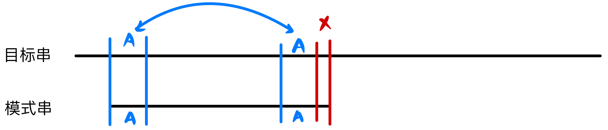
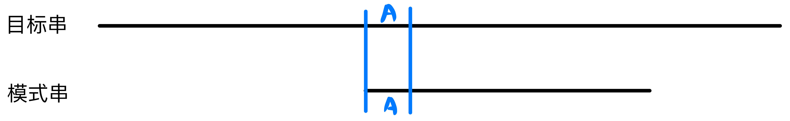
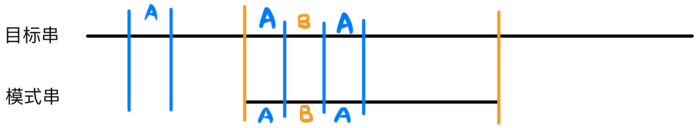
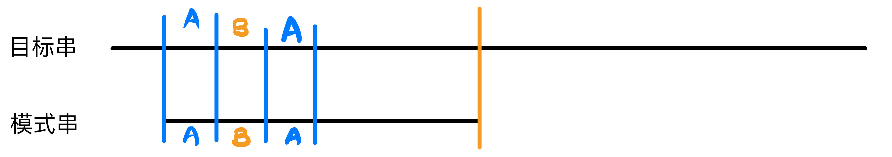
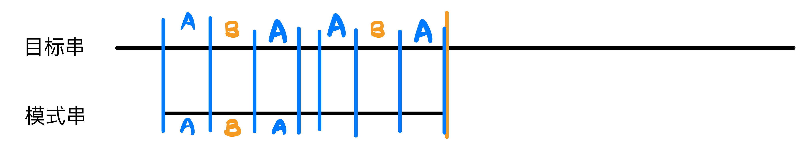
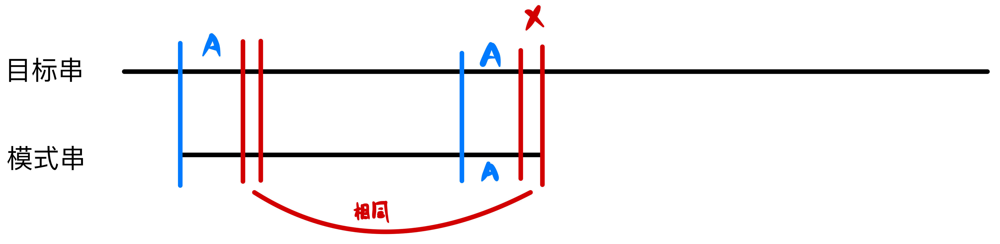

# 数算第四章作业

梁昱桐 2100013116

**1. 假设以链表结构`LString`(定义如下)作为串的存储结构，试编写判别给定串 S 是否具有对称性的算法，并要求算法的时间复杂度为$O(StrLength(S))$**

```c++
struct ListNode
{
	char data; //存放数据;
	ListNode* next; //存放指向后继结点的指针;
};
typedef ListNode* ListPtr;
struct LString {
	ListPtr head; //链表的表头指针
	int strLen; //串的长度 
};
```

```c++
//将链表的所有数据排列成一个字符串，如果字符串是对称的那么链表就是对称的
bool is_symmetry(LString x) //如果链表是对称的就返回true
{
    if (x.strLen == 0) //特判空链表不对称
        return false;
    string all_data; //所有的数据构成的字符串
    for (ListPtr i = x.head; i - x.head < x.strLen; i++)
        all_data += i->data; //取出每一个节点的数据放入all_data
    for (int i = 0; i < x.strLen; i++)
        if (all_data[i] != all_data[x.strLen - i - 1])
            return false;
    return true;
}
```

时间复杂度：第一个和第二个循环均遍历一次$0$到$n$的链表和字符串，因此该算法的时间复杂度是$O(StrLength(S))$的

空间复杂度：算法使用一个辅助字符串，字符串长度与链表长度成正比，因此该算法的空间复杂度是$O(StrLength(S))$的

**2. 写出一个线性时间的算法，判断字符串 T 是否是另一个字符串 T’ 的循环旋转。例 如 arc 和 car 是彼此的循环旋转。**

```c++
Input: string a,string b
Output: bool is_permutation_symmetry
```

如果$a$和$b$互为循环旋转，那么首先$a$与$b$的长度相同；其次将$a$的前一部分和后一部分交换位置便构成了$b$，因此将两个$a$连接起来便一定包含了所有可能的循环旋转串，只要使用$KMP$算法在$a+a$字符串中寻找$b$即可

```c++
string a, b;
int la = a.length(), lb = b.length();
vector<int> next_b; // b串的next数组
void get_next()     //求b串的next数组
{
    next_b[0] = -1;
    int i = 0, j = -1;
    while (i < lb)
        if (j == -1 || b[i] == b[j])
            next_b[++i] = ++j;
        else
            j = next_b[j];
}
bool kmp() //在a+a中寻找b，如果找到就返回true
{
    int i = 0, j = 0;
    while (i < la)
    {
        if (j == -1 || a[i] == b[j]) //匹配了就增加指针
            i++, j++;
        else //不匹配就将模式串指针回溯，从而从模式串更靠前的位置开始匹配
            j = next_b[j];
        if (j == lb) //存在匹配可能，返回true
            return true;
    }
    return false;
}
bool is_permutation_symmetry()
{
    cin >> a >> b;
    if (a.length() != b.length()) //特判长度不相等，一定不是循环对称串
        return false;
    a += a;
    la = a.length(), lb = b.length();
    next_b.resize(lb + 1);
    get_next();
    return kmp();
}
```

字符串$a$和字符串$b$长度一定相等，否则一定不互为循环旋转串，设他们的长度均为$n$

时间复杂度：主要复杂度在于匹配字符串$a+a$和$b$，根据$KMP$算法的特性，时间复杂度为$O(n)$

空间复杂度：算法使用一个$next$数组，空间复杂度是$O(n)$的

**3. 请证明教材中 KMP 数组(优化和非优化两种)算法正确性。**

首先考虑一般情况下的$KMP$算法：



如图$1$，当我们发现模式串和目标串存在不匹配的情况时，我们会根据$next$数组找到已经匹配的部分中最长的公共前后缀，即$A$串，并将模式串后移直到模式串的$A$和目标串的$A$再次重合



如图$2$，我们使模式串的$A$和目标串的$A$再次重合，继续向后逐个字符比对模式串和目标串

想要证明$KMP$算法的正确性，我们需要证明模式串在两个子串$A$间跳跃的时候不会出现完全匹配的情况

以下考虑使用反证法



如图$3$，假设两个子串$A$间模式串可以被完全匹配，即与目标串的橙色区域匹配

那么由于模式串的最前面存在一个子串$A$，则橙色区域的前面也会存在一个子串$A$，这两个子串可能重叠，也可能间隔一个子串$B$，但是这不影响模式串的最前面有一个长度大于$A$的子串，不妨记为$ABA$



根据图$1$，**模式串与目标串在一开始可以在两个子串$A$间均匹配**，因此将模式串移动回到初始状态，如图$4$

此时模式串有了一个新前缀$ABA$



根据反证假设，目标串在一开始的两个子串$A$间有一个后缀$ABA$，并且由于模式串与目标串在一开始可以在两个子串$A$间均匹配，那么模式串也有一个后缀$ABA$，如图$5$

那么我们得到结论，图$1$中的模式串在两个子串$A$间有一个更长的公共前后缀$ABA$，但这与$next$数组的定义矛盾，因此假设不成立，两个子串$A$间模式串不可以被完全匹配，$KMP$算法正确性得证		$\blacksquare$

现在考虑优化后的$next$数组的$KMP$算法：



如上图，其实$next$数组的优化只是优化了当不能匹配时，模式串共同前后缀的后一个字符相等的情况，如果相等就更改$next$数组使得不必进行不可能匹配的比较后一个字符的操作

实际上这个操作只是减少了一次$KMP$比较操作，跟一般的$KMP$算法进行两次比较具有同样的效果，如果$KMP$算法是正确的，那么优化后的$KMP$算法自然也正确		$\blacksquare$